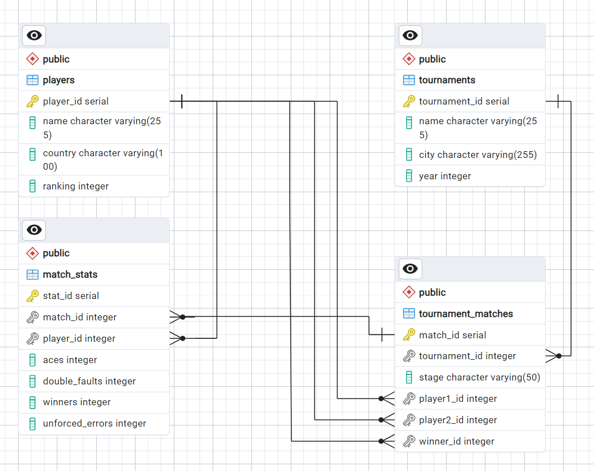

``` sql
-- 1. Таблица турниров
CREATE TABLE tournaments (
    tournament_id SERIAL PRIMARY KEY,
    name VARCHAR(255),
    city VARCHAR(255),
    year INT
);

-- 2. Таблица игроков
CREATE TABLE players (
    player_id SERIAL PRIMARY KEY,
    name VARCHAR(255) NOT NULL,
    country VARCHAR(100),
    ranking INT
);

-- 3. Таблица матчей
CREATE TABLE tournament_matches (
    match_id SERIAL PRIMARY KEY,
    tournament_id INT REFERENCES tournaments(tournament_id),
    stage VARCHAR(50),
    player1_id INT REFERENCES players(player_id),
    player2_id INT REFERENCES players(player_id),
    winner_id INT REFERENCES players(player_id)
);

-- 4. Таблица статистики матча
CREATE TABLE match_stats (
    stat_id SERIAL PRIMARY KEY,
    match_id INT REFERENCES tournament_matches(match_id),
    player_id INT REFERENCES players(player_id),
    aces INT,
    double_faults INT,
    winners INT,
    unforced_errors INT,
);
```